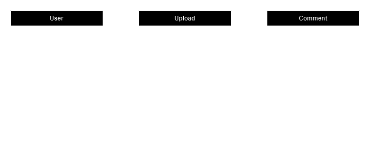

# VideoVault

VideoVault is a dynamic video sharing and streaming platform inspired by YouTube. It allows users to upload, share, and stream videos.

Key features include:

- **Video Uploads:** Users can upload videos in various formats and share them.
- **Streaming:** High-quality streaming capabilities ensure a smooth viewing experience.
- **User Accounts:** Users can create accounts, manage their video uploads.
- **Comments and Likes:** Users can engage with videos by leaving comments and likes.
- **Search and Discovery:** A robust search function allows users to find specific videos.

This project aims to replicate the core functionality of YouTube, providing a platform for learning and experimenting with video hosting and streaming technologies.

## Data Models

The Entity-Relationship Diagram (ER-Diagram) below provides a visual representation of these data models, illustrating how different entities relate to each other within the system.

